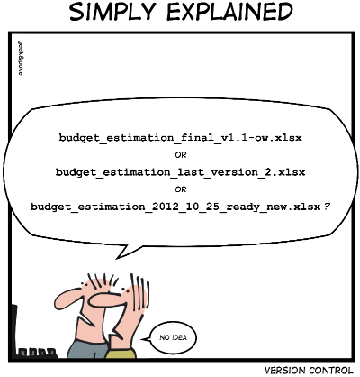

### ITSE-1402 Intermediate Python
<span style="font-family:Helvetica Neue; font-weight:bold; color:#e49436">Class 1: Python Review | Course Introduction | Git Overview | IDE</span>

-----

## Introductions

+++++

### Instructor


Philip Ulrich

[philip.ulrich@austincc.edu](mailto:philip.ulrich@austincc.edu)
[https://www.telegram.me/PhilipUlrich](https://www.telegram.me/PhilipUlrich)

Note:
Education:
- BS, Information Technology; Minor in Computer Science

Occupation: 
- Windows Administrator @ Rackspace

Experience: 
- Programming as a hobbyist for over 8 years using a mixture of Bash, Java, PHP, Powershell, Python, Swift, VB Basic, and a little bit of Javascript.
- Currently am a developer on multiple internal tooling projects at Rackspace.

+++++

### Student Introductions
<br />
Ideas:
- Name
- Occupation
- Experience with Programming
- Did you attend Introduction to Python?
- What do you hope to learn from this class?
- What do you hope to do with it afterwards?

Note:
Any and all of these are optional. At the very least, just tell us your name. 

-----

## Attendance

-----

## Course Resources

+++++

### Course Resources
- GitHub
- Cloud9 IDE

+++++

#### GitHub
<br />
Website: [https://github.com](https://github.com)
<br /><br />
Login: You can either use your existing GitHub username or a new one. If you are using a new one, please go through the account sign up process as you normally would.

+++++

#### GitHub
<br />
Purpose:
- Code repository for the class. Class files will be cloned from here into your workspaces in Cloud 9. 
- You will treat assignments/projects as if they were projects you are maintaining on GitHub. All assignments and projects will be submitted via GitHub.

NOTE: Any material assigned/turned in is private by default. Any repos you make also can be private as well. Personal GitHub accounts are okay for use in this course. 

+++++

#### Cloud9 IDE
<br /><br />
Website: https://c9.io
<br /><br />
Login: 
- You will sign up for this service under an invite sent to your email. No CC is required (these are "student" accounts).
- Once completed, you have access to the class workspace and primary IDE we will be utilizing. 

+++++

#### Cloud9 IDE
<br />
Purpose:
- Primary working environment for the class. We will create a workspace for each class session.
- Class files will be cloned from GitHub to a C9 workspace. From here, you will work your assignments and push changes to your GH repo. Assignments will be graded based on repository contents.

+++++

#### Preparing Cloud9

- Log in to your Cloud9 account and go to the settings area.
- Click on Connected Services and connect your GitHub account. 
- Go back to your dashboard and create your 1 alloted private repo with the name "class-workspace".
- For team, choose "Don't set a team for this workspace"
- Choose "Blank" for your workspace and leave everything else default.
- Click "Create Workspace"

+++++

##### Importing Your First Repo

- First grab the assignment from the following link: [https://z3r0.tech/1402-example](https://z3r0.tech/1402-example)
- With your workspace open, clone the repository into your workspace directory
    - Hint: `git clone git@github.com:ITSE-1402/example-repo-myusername`
- Open the folder "example-repo-myusername" on the left side and open the "README.md" file.
- Click "Preview" in the menu bar then "Live Preview File (README.md)"
- Follow the instructions. 

-----

## Syllabus

+++++

[https://itse-1402.github.io/syllabus/](https://itse-1402.github.io/syllabus/)

Short Link: [https://z3r0.tech/1402-syllabus](https://z3r0.tech/1402-syllabus)

-----

## Git

+++++

#### Git
- What is version control? 
- What is Git?
- What is GitHub?
- Using Git day-to-day
- Collaborating online with Github

-----

## What is version control?

+++++


<br />
via [Geek and Poke](http://geek-and-poke.com/)

+++++

- It’s a time machine for files
- Checkpoints through a project
- Also known as revision control

+++++

#### Used For:
- Types of Files
  - Text-Based Files (scripts, configs, etc.)
  - Binary Files (with exceptions)
  - Images (with exceptions)
- Files Shared With Others
  - Keeps Track of Who Did What
  - Allows Reverting to Previous Versions
- Code Deployment (Or Any Deployment)
  - Ensures the Correct Version is Deployed

+++++


<br />
via [Tower](https://www.git-tower.com/learn/git/ebook/en/command-line/basics/what-is-version-control)

-----

## What is Git?

+++++

Definition from the Internet: 

Git is a free and open source distributed version control system designed to handle everything from small to very large projects with speed and efficiency.

+++++

#### Installing Git

- Git is available for all the major OSes
  - Linux, Windows, OS X
- http://git-scm.com/downloads

* git will already be installed in our workspaces

+++++

#### What is a Repository?

- A repository is the place that stores all the data for your version controlled directory.
  - More or less, it is the database for all the versions, metadata, file contents, etc.
- A repository can live on a local machine, cloud server, or really any computer. 
- Repositories can be cloned and shared

-----

## What is GitHub?

+++++

#### Definition from the Internet: 

GitHub is a web-based Git or version control repository and Internet hosting service. It offers all of the distributed version control and source code management (SCM) functionality of Git as well as adding its own features.

+++++

- GitHub is a web-based Git repository hosting service
  - Centralized repository

- Social coding features
  - Pull request
  - Documentation (markdown)
  - Wikis
  - Issue tracking
  - Small websites
  - History browsing
  - Code reviews

-----

## Using Git Day-to-Day (Part 1)

+++++

#### Git Commands:

- git init: Create repository
  - Ex: git init .

- git add: add file(s) to commit
  - Ex: git add text-file.txt image.png

- git commit: commit changes that were added
  - Ex: git commit -m “a comment about things”

- git push: push changes to remote (github, gitlab, etc)
  - Ex: git push

+++++

#### Git Commands (cont.):

- git fetch: grab latest changes from origin/master
  - Ex: git fetch<br />(You likely won’t be using this from the get-go)

- git pull: essentially does a git fetch and git merge
  - Ex: git pull<br />More likely to be used. Updates local branch.

- git status: tells current status of the repo
  - Ex: git status

+++++

#### Git Commands (cont.):

- git rm: removes file(s) from the repo
  - Ex: git rm text-file.txt image.png

- git reset: removes a file added (git add) before commit
  - Ex: git reset other-file.txt

- git checkout -- changed-file.txt
  - Reverts all edits to a specific file

+++++


<br />
via [Oliver Steele Blog](http://blog.osteele.com/2008/05/my-git-workflow/)

-----

## Lab 1

(https://z3r0.tech/1402-git)[https://z3r0.tech/1402-git]

Note:
Create this repo and clone it into your workspace. All 3 labs are in this repo. We will just be completing Lab 1 for now. 

-----

## Using Git Day-to-Day (Part 2)

+++++

Versioning isn’t always smooth sailing...
<br />

<br />
It also isn’t always linear.

+++++

#### Intermediate Git Concepts

- Branching
- Conflicts
- Merging

+++++

#### Branches

A git branch is a separate line of development from the master branch and other branches. 

Branches are typically used for different features or versions of the content being developed. 

+++++


<br />
via [Leanpub](https://leanpub.com/git-flow/read)

Note:
The master branch is special and is regarded as the current state of the repository.

It is considered the core branch that changes are merged into.

Branches are not strictly required to be merged into the master.

While the master branch is considered special and the current state of the repo, git sees it as any other branch. 

+++++

#### Conflicts

- A merge conflict happens when you to merge conflicting changes between branches.
  - Example: in your README file
    - master: Hello, cat!
    - alice/master: Hello, dog!
  - Git can't tell which one it should go with, so it tells you to pick
- Git trys to resolve as many conflicts as possible without interaction, but with the above example there is no clear solution.

+++++

#### Git Commands:

- git branch: Create branch
  - Ex: git branch my_branch

- git checkout: switch to a branch
  - Ex: git checkout my_branch

- git checkout -b: shortcut to create and switch
  - Ex: git checkout -b my_branch

+++++

#### Merging

Merging branches is when you take the changes from one branch and put them in another. 

Example:
- git checkout master
- git merge my_branch

-----

## Lab 2

-----

## Lab 3

-----

## Cheat Sheet

-----

##### Python Review - Part 1


##### Caption: "I wrote 20 short programs in Python yesterday.  It was wonderful.  Perl, I'm leaving you." - via [xkcd](https://xkcd.com/353/)

+++++

[https://z3r0.tech/1402-review](https://z3r0.tech/1402-review)

Note:
Let's get the review repo cloned in. 

+++++

### Chapter 1 - Exercise 1-1

Note:
We'll start off our review with some basic review of syntax.

+++++

#### Question 1

+++++

```python
#!/usr/bin/env python3

# 1. In a print statement, what happens if you leave out one of the
# parentheses, or both?")
```

Note:
There is a couple different ways this can play out depending on how you interpret it. 

+++++

```python
#!/usr/bin/env python3

# 1. In a print statement, what happens if you leave out one of the
# parentheses, or both?")

print'test')
# One parenthesis:
#   File "<stdin>", line 1
#        print'test')
#                  ^
#   SyntaxError: invalid syntax

print 'test'
# Both parentheses (or space and one missing parenthesis):
#   File "<stdin>", line 1
#       print 'test'
#                   ^
#   SyntaxError: Missing parentheses in call to 'print'
```

Note:
The difference is in the first part of the question. If you do space and one parenthesis, you get the same answer as the second.

+++++

#### Question 2

+++++

```python
#!/usr/bin/env python3

# 2. If you are trying to print a string, what happens if you leave out one of
# the quotation marks, or both?
```

Note:
Does this one have a similar property to the one before? Or will the answer be the same both ways?

+++++

```python
#!/usr/bin/env python3

# 2. If you are trying to print a string, what happens if you leave out one of
# the quotation marks, or both?

print('test)
# One quotation
#     File "<stdin>", line 1
#      print('test)
#                   ^
#    SyntaxError: EOL while scanning string literal

print(test)
# Both Quotations
#   Traceback (most recent call last):
#     File "<stdin>", line 1, in <module>
#   NameError: name 'test' is not defined
```

Note:
Unlike the other example either parenthesis left out leads to the same result. 

+++++

#### Question 3

+++++

```python
#!/usr/bin/env python3

# 3. You can use a minus sign to make a negative number like -2. What happens 
# if you put a plus sign before a number? What about 2++2?
```
+++++

```python
#!/usr/bin/env python3

# 3. You can use a minus sign to make a negative number like -2. What happens 
# if you put a plus sign before a number? What about 2++2?

# -2 == -2
# +2 == +2
# 2++2 == 4
```

+++++

#### Question 4

+++++

```python
#!/usr/bin/env python3

# 4. In math notation, leading zeros are okay, as in 02. What happens if you 
# try this in Python?
```

+++++

```python
#!/usr/bin/env python3

# 4. In math notation, leading zeros are okay, as in 02. What happens if you 
# try this in Python?

# 02
#     File "<stdin>", line 1
#       02
#        ^
#   SyntaxError: invalid token
```

Note:
In python2 the leading zero makes python interpret it as octal. In python3, it results in a syntax error. 

+++++

#### Question 5

+++++

```python
#!/usr/bin/env python3

# 5. What happens if you have two values with no operator between them?"
```

+++++

```python
#!/usr/bin/env python3

# 5. What happens if you have two values with no operator between them?"

# No space
#   Traceback (most recent call last):
#     File "<stdin>", line 1, in <module>
#   NameError: name 'ab' is not defined

# Space
#     File "<stdin>", line 1
#       a b
#         ^
#     SyntaxError: invalid syntax
```

Note:
Obviously 2 numbers next to each other makes whatver number it is. 5 and 5 = 55. When you do it with two variables, we get different results.

+++++

### Chapter 1 - Exercise 1-2

Note:
This time we are using the interpreter as a calculator just to see how python works with mathematical expressions (and stretch our brain muscles).

+++++

#### Question 1

+++++

```python
#!/usr/bin/env python3

# 1. How many seconds are there in 42 minutes 42 seconds?
```

+++++

```python
#!/usr/bin/env python3

# 1. How many seconds are there in 42 minutes 42 seconds?
x = (42*60)+42
print(x)
# 2562
```

+++++

#### Question 2

+++++

```python
#!/usr/bin/env python3

# 2. How many miles are there in 10 kilometers? Hint: there are 1.61 kilometers 
# in a mile.
```

+++++

```python
#!/usr/bin/env python3

# 2. How many miles are there in 10 kilometers? Hint: there are 1.61 kilometers 
# in a mile.
x = 10/1.61
print(x)
# 6.211180124223602
```

Note:
This is a little messy, so we can clean it up with format.

+++++

```python
#!/usr/bin/env python3

# 2. How many miles are there in 10 kilometers? Hint: there are 1.61 kilometers 
# in a mile.
x = 10/1.61
print('{:03.2f}'.format(x))
# 6.21dd
```

Note:
In short, this specifies the precision for floating point numbers. It's specifying that we want at least 3 numbers, with two trailing after the decimal. 
https://pyformat.info/ is your friend when it comes to these formats. We'll also talk about them more next class. 
+++++

#### Question 3

+++++

```python
#!/usr/bin/env python3

# 3. If you run a 10 kilometer race in 42 minutes 42 seconds, what is your 
# average pace (time per mile in minutes and seconds)? What is your average
# speed in miles per hour?
```

+++++

```python
#!/usr/bin/env python3

# 3. If you run a 10 kilometer race in 42 minutes 42 seconds, what is your 
# average pace (time per mile in minutes and seconds)? What is your average
# speed in miles per hour?")

answer1=((42*60)+42)/(10/1.61)/60
answer2=60/answer1
print("Min per mile:\t{:03.2f}\nMPH:\t\t{:03.2f}\n".format(answer1,answer2))  
```

Note: We start with our the answer to question 1. Divide that by the answer to question 2. Then we divide that by 60 to get our minutes per mile. For the miles per hour, we divide 60 by the minutes per mile.

+++++

All extra credit should be submitted to the following repo:

[https://z3r0.tech/1402-ec](https://z3r0.tech/1402-ec)